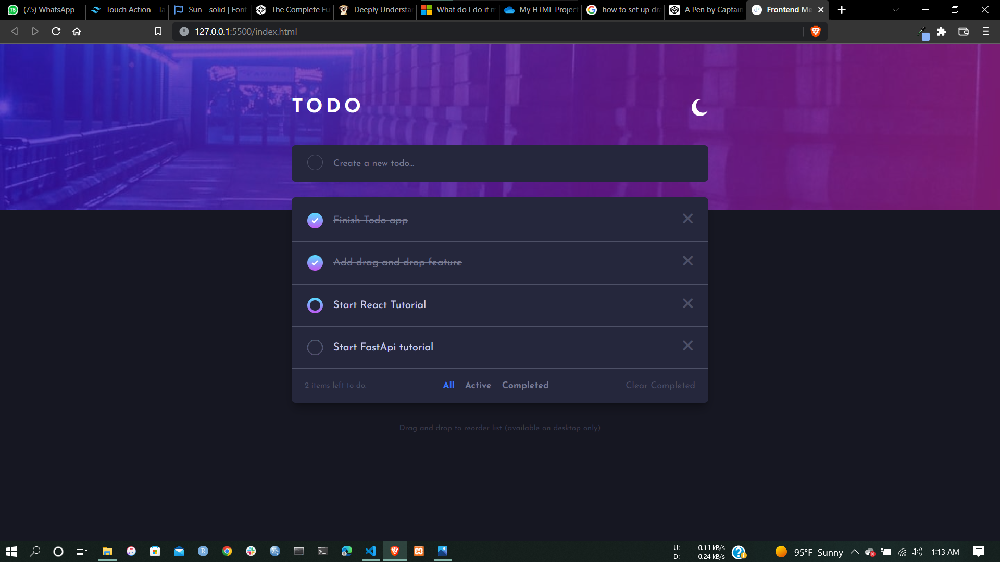
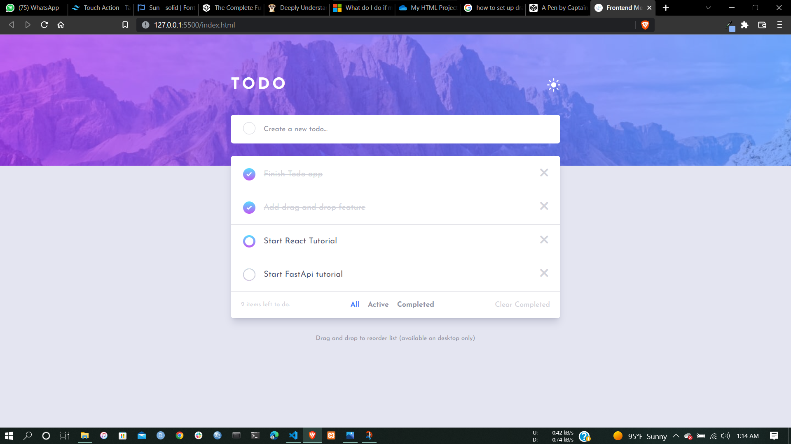
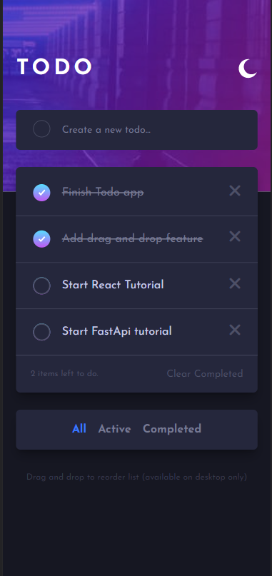
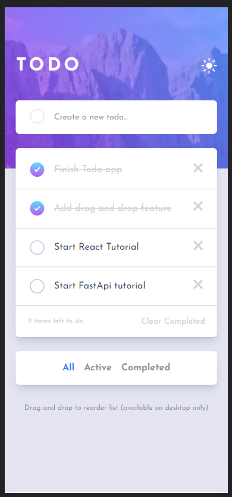

# Frontend Mentor - Todo app solution

This is a solution to the [Todo app challenge on Frontend Mentor](https://www.frontendmentor.io/challenges/todo-app-Su1_KokOW). Frontend Mentor challenges help you improve your coding skills by building realistic projects.

## Table of contents

- [The challenge](#the-challenge)
- [Screenshot](#screenshot)
- [Links](#links)
- [Built with](#built-with)
- [What I learned](#what-i-learned)
- [Continued development](#continued-development)

### The challenge

Users should be able to:

- View the optimal layout for the app depending on their device's screen size
- See hover states for all interactive elements on the page
- Add new todos to the list
- Mark todos as complete
- Delete todos from the list
- Filter by all/active/complete todos
- Clear all completed todos
- Toggle light and dark mode
- **Bonus**: Drag and drop to reorder items on the list

### Screenshot

### Links

- [Solution URL](https://github.com/Toby2507/todo-app-frontend-)
- [live Site URL](https://toby2507.github.io/todo-app-frontend-/)

### Built with

- Semantic HTML5 markup
- TailWindCSS
- Flexbox
- CSS Grid
- Mobile-first workflow
- Vanilla JS - async-await, promise and oop

### What I learned

I learnt how to utilize HTML5 drag functionality and It was a very insightfull endeavour and I got to work with events alot hence, I was able to gain better understanding about event bubbling, hoisting and DOM manipulation.

### Continued development

This is my final project before starting my react journey and I finally finished it so I'm starting React as soon as possible. Learning never stops.
